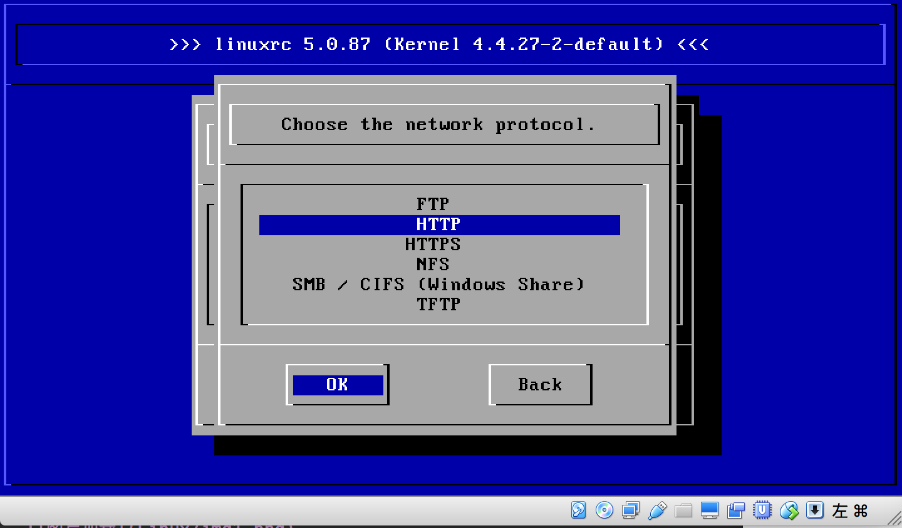
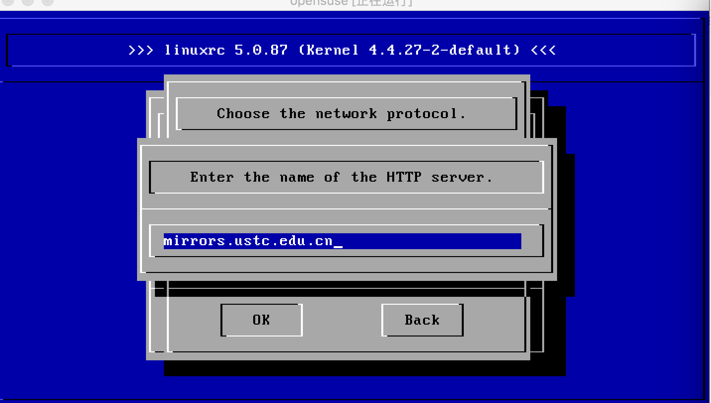
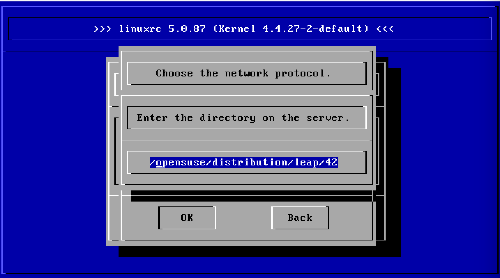

## 常用Linux环境安装集合

### VirtualBox安装
注:此处安装演示环境为OS X EI Capitan 10.11.6 
1.从官网下载最新版的安装包进行安装 
&nbsp;&nbsp;&nbsp;安装包下载地址:https://www.virtualbox.org 
2.双击.dmg进行安装 
3.将.app文件放置在/Applications目录下 

##### VirtualBox-OpenSuSE安装增强功能
	注:需要使用文件共享、粘贴复制等功能时的需要 
	1.从安装包中的iso挂载 
	2.在实例窗口中选择(设备->安装增强功能) 
	3.挂载相关的扩展包内容到制定磁盘(如下命令) 
	mount /dev/cdrom /mnt/ 
	4.依赖环境安装检查与安装(如下命令) 
	yum install -y gcc gcc-devel gcc-c++-devel make kernel-devel 
	5.进行增加功能的安装(如下命令) 
	1.cd /mnt/ 
	2../VBoxLinuxAdditions.sh 
	6.当安装成功后会有提示让您输入(reboot)命令进行重启

### OpenSuSE安装
注:此处使用VirtualBox进行安装并且OpenSuse使用在线安装模式 
1.安装镜像源下载地址: 
&nbsp;&nbsp;&nbsp;镜像下载地址: 
2.使用VirtualBox虚拟机装载iso镜像文件 

#### 重点截图
1.当出现如下画面后选择[<b>安装</b>] 

2.当出现如下画面后请根据图片步骤进行操作

注:opensuse中科大镜像地址为:http://mirrors.ustc.edu.cn/opensuse/

3.zypper install -t pattern kde4 kde4\_basis(安装图形化界面) 

### Sun Jdk安装与配置
1.从http://www.oracle.com/technetwork/java/javase/downloads/index.html下载(jdk-8u121-linux-x64.tar.gz) 
2.在Linux的/home目录下创建java的目录(mkdir /home/java) 
3.将jdk-8u121-linux-x64.tar.gz使用cp命令复制到/home/java目录下 
4.使用tar -xf jdk-8u121-linux-x64.tar.gz 进行解压 
5.使用 vi /etc/profile 环境变量配置（配置内容如下) 
  JAVA\_HOME=/home/java/jdk1.8.0\_121 
  CLASSPATH=.:$JAVA\_HOME/lib/tools.jar:$JAVA\_HOEM/lib/dt.jar 
  PATH=$JAVA\_HOME/bin:$PATH 
  export JAVA\_HOME CLASSPATH PATH 
6.修改系统默认的java指向 
alternatives --install /usr/bin/java java /home/java/jdk1.8.0\_121/bin/java 500 
7.使用java -version查看命令是否可用 

### Oracle 11g安装
##### 非静默安装
1.从官网下载2个文件分别为linux.x64\_11gR2\_database\_1of2.zip与linux.x64\_11gR2\_database\_2of2.zip(https://www.oracle.com/downloads/index.html) 
2.在Linux的/home路面下面创建oracle的目录(mkdir /home/oracle) 
3.将压缩包zip使用cp 命令复制到/home/oracle目录下 
4.使用unzip命令解压文件 unzip linux.x64\_11gR2\_database\_1of2.zip 
5.使用unzip命令解压文件 unzip linux.x64\_11gR2\_database\_2of2.zip 
6.内核参数修改如下 
&nbsp;&nbsp;&nbsp;vi /etc/sysctl.conf 
&nbsp;&nbsp;&nbsp;fs.aio-max-nr = 1048576 
&nbsp;&nbsp;&nbsp;fs.file-max = 6815744 
&nbsp;&nbsp;&nbsp;kernel.shmall = 2097152 
&nbsp;&nbsp;&nbsp;kernel.shmmax = 536870912 
&nbsp;&nbsp;&nbsp;kernel.shmmni = 4096 
&nbsp;&nbsp;&nbsp;kernel.sem = 250 32000 100 128 
&nbsp;&nbsp;&nbsp;net.ipv4.ip\_local\_port\_range = 9000 65500 
&nbsp;&nbsp;&nbsp;net.core.rmem\_default = 262144 
&nbsp;&nbsp;&nbsp;net.core.wmem\_default = 262144 
&nbsp;&nbsp;&nbsp;net.core.rmem\_max = 4194304 
&nbsp;&nbsp;&nbsp;net.core.wmem\_max = 1048586  
7.要使/etc/sysctl.conf 更改立即生效，执行以下命令 sysctl -p  
8.vi /etc/security/limits.conf,修改操作系统对oracle用户资源的限制 
&nbsp;&nbsp;&nbsp;oracle	soft	nproc	2047 
&nbsp;&nbsp;&nbsp;oracle	hard	nproc	16384 
&nbsp;&nbsp;&nbsp;oracle	soft	nofile	1024 
&nbsp;&nbsp;&nbsp;oracle	hard	nofile	65536 
&nbsp;&nbsp;&nbsp;oracle	hard	stack	10240 
9.安装vncserver服务 yum -y install tigervnc-server 
10.启动vncserver服务(vncserver) 
10.export DISPLAY=localhost:1 
11.xhost + 
12.groupadd oracle(添加oracle群组) 
13.useradd -g oracle oracle(添加oracle群组下的oracle用户) 
14.passwd oracle(设置oracle的密码) 
15.安装前所需要的依赖包： 
&nbsp;&nbsp;&nbsp;binutils-2.17.50.0.6-2.el5 
&nbsp;&nbsp;&nbsp;compat-libstdc++-33-3.2.3-61 
&nbsp;&nbsp;&nbsp;elfutils-libelf-0.125-3.el5 
&nbsp;&nbsp;&nbsp;elfutils-libelf-devel-0.125 
&nbsp;&nbsp;&nbsp;elfutils-libelf-devel-static 
&nbsp;&nbsp;&nbsp;glibc-2.5-12 
&nbsp;&nbsp;&nbsp;glibc-common-2.5-12 
&nbsp;&nbsp;&nbsp;kernel-headers 
&nbsp;&nbsp;&nbsp;ksh 
&nbsp;&nbsp;&nbsp;libaio-0.3.106 
&nbsp;&nbsp;&nbsp;libaio-devel-0.3.106 
&nbsp;&nbsp;&nbsp;libgcc-4.1.1-52 
&nbsp;&nbsp;&nbsp;libgomp 
&nbsp;&nbsp;&nbsp;libstdc++-4.1.1 
&nbsp;&nbsp;&nbsp;libstdc++-devel-4.1.1-52.e15 
&nbsp;&nbsp;&nbsp;make-3.81-1.1 
&nbsp;&nbsp;&nbsp;mpfr-2.4.1-6.el6.i686.rpm 
&nbsp;&nbsp;&nbsp;ppl-0.10.2-11.el6.i686.rpm 
&nbsp;&nbsp;&nbsp;sysstat-7.0.0 
&nbsp;&nbsp;&nbsp;unixODBC-2.2.11 
&nbsp;&nbsp;&nbsp;unixODBC-devel-2.2.11 
&nbsp;&nbsp;&nbsp;glibc-headers-2.5-12 
&nbsp;&nbsp;&nbsp;glibc-devel-2.5-12 
&nbsp;&nbsp;&nbsp;cloog-ppl-0.15.7-1.2.el6.i686.rpm 
&nbsp;&nbsp;&nbsp;cpp-4.4.4-13.el6.i686.rpm 
&nbsp;&nbsp;&nbsp;gcc-4.1.1-52 
&nbsp;&nbsp;&nbsp;gcc-c++-4.1.1-52 
&nbsp;&nbsp;&nbsp;numactl-devel-0.9.8.i386 
16.编辑配置文件vi .bash_profile,添加如下配置 
umask 022 
export ORACLE_BASE=/home/oracle/app  
export ORACLE_HOME=$ORACLE_BASE/oracle/product/11.2.0/dbhome_1  
export ORACLE_SID=orcl  
export PATH=\$PATH:\$HOME/bin:$ORACLE\_HOME/lib:/usr/lib  
export LD\_LIBRARY\_PATH=\$ORACLE\_HOME/lib:/usr/lib 
17.su oracle(使用oracle进行安装) 
18.export LANG=en\_US.UTF-8 
19.创建数据库软件目录和数据文件存放目录，目录的位置，根据自己的情况来定，注意磁盘空间即可，这里我把其放到oracle用户下 
mkdir /home/oracle/app 
mkdir /home/oracle/app/oracle 
mkdir /home/oracle/app/oradata 
mkdir /home/oracle/app/oracle/product 
20.更改目录属主为Oracle用户所有，输入命令：chown -R oracle:oracle /home/oracle/  
21.进入到安装目录下运行脚本	 cd /home/oracle/database 
22.运行安装程序 ./runInstaller  
23.安装完后执行配置脚本

### Hadoop 安装

1.从http://www.oracle.com/technetwork/java/javase/downloads/index.html下载(jdk-8u121-linux-x64.tar.gz) 
2.在Linux的/home目录下创建java的目录(mkdir /home/java) 
3.将jdk-8u121-linux-x64.tar.gz使用cp命令复制到/home/java目录下 
4.使用tar -xf jdk-8u121-linux-x64.tar.gz 进行解压 
5.使用 vi /etc/profile 环境变量配置（配置内容如下) 
JAVA\_HOME=/home/java/jdk1.8.0\_121 
CLASSPATH=.:$JAVA_HOME/lib/tools.jar:$JAVA\_HOEM/lib/dt.jar 
PATH=$JAVA\_HOME/bin:$PATH 
export JAVA\_HOME CLASSPATH PATH 
6.修改系统默认的java指向 alternatives --install /usr/bin/java java /home/java/jdk1.8.0\_121/bin/java 500  
7.使用java -version查看命令是否可用 
8.mkdir /home/hadoop 创建hadoop文件夹信息 并且使用cd /home/hadoop进入到该文件夹当中 
9.从http://mirrors.cnnic.cn/apache/hadoop/common/下载(hadoop-2.7.3.tar) 
10.使用tar xf hadoop-2.7.3.tar进行解压 
11.vi /home/hadoop/etc/hadoop/hadoop-env.sh 编写如下配置信息 找到JAVA变量进行相关的内容
JAVA\_HOME=/home/java/jdk1.8.0\_121 
12.进入/home/hadoop/sbin(cd /home/hadoop/sbin) 
13.执行启动文件进行启动测试(./start-all.sh)

### Redis 安装

### Hbase 安装
